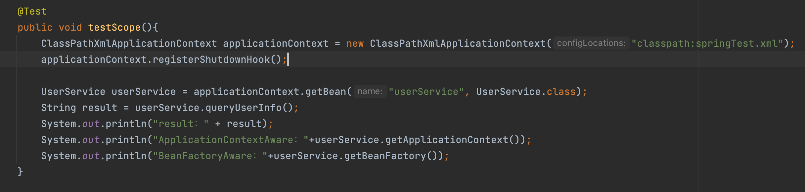
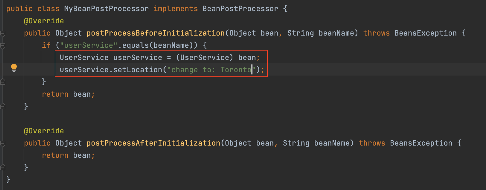
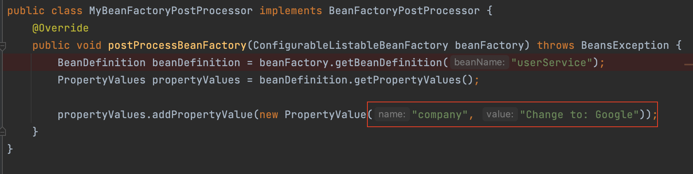
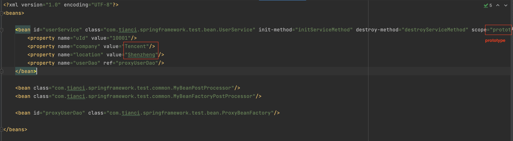
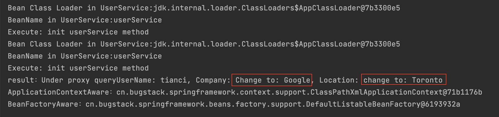
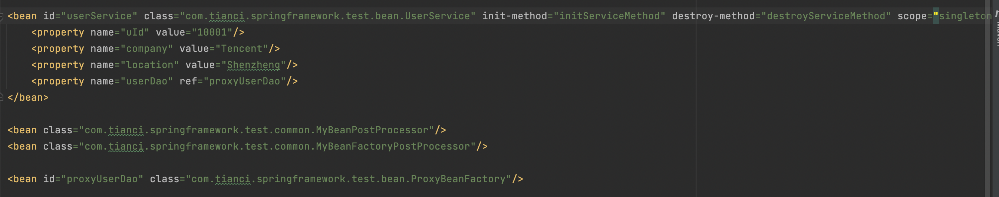
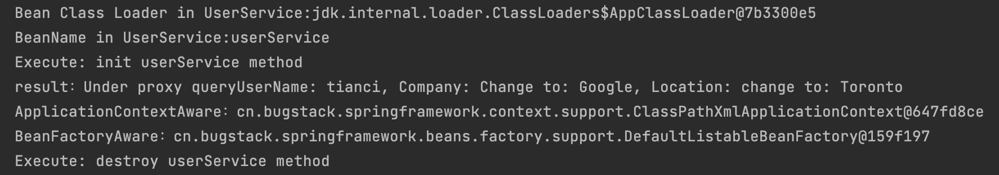
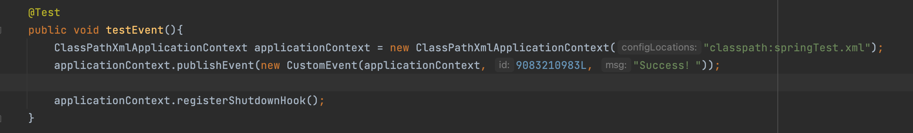
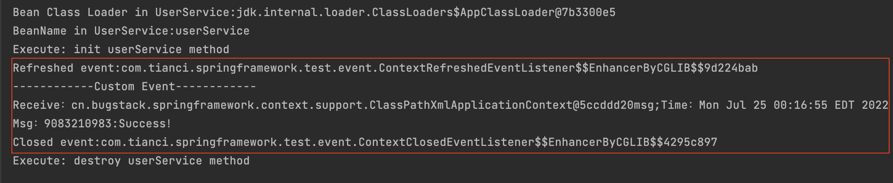

# Spring Framework
After looking into the source code of the spring framework, simulate an easy version of spring to learn its design principal and project hierarchy. And gain some insights on how to write a project with strong extendibility.

# Testing Result

**Test Code:**

## Processor + Different Scope

**Processor:**

**Case 1**: scope="prototype"

Result when scope is prototype:

**Case 2**: scope = "singleton" (by default)

Result:

(Only initiate once. During the second time, will get the bean from cache.)

## Event:

**Result:**

